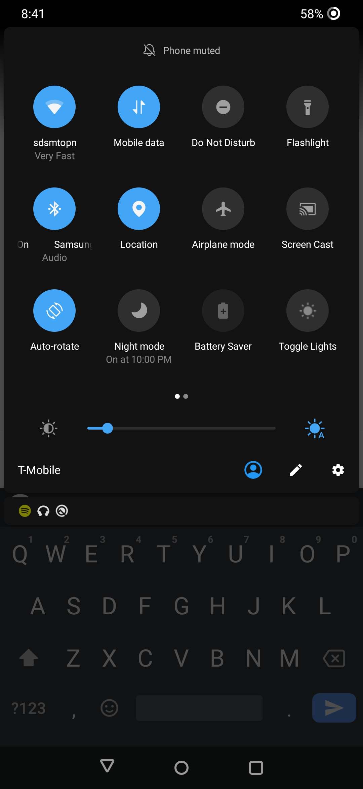
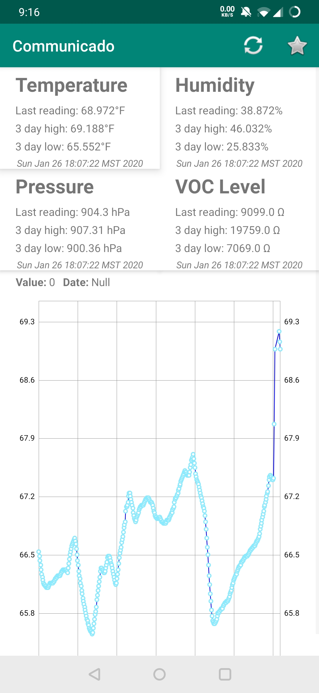

# Smart Home Project
This is a home project written by me as a way to get the data from my bme680 sensor from my Raspberry Pi to my Android phone, as well as control the lights in my bedroom with my phone. The messaging between the Pi and the app is done through PubNub, which means that if you want to reproduce this project on your own hardware, you'll have to get a new set of free PubNub API keys.

# Communicado App

This is pretty simple, since I anticipate I'll be the only one to actually use it. It's a one page/activity app, with 4 panels that display the temperature, pressure, VOC gas resistance and humidity. Below is a graph implemented using the MP Android Chart library. The default graph is for temperature, but it can be toggled to any of the other values by clicking on that panel.The graph can be scrubbed left to right to display the value and the date of that particular data point. 

There are two buttons on the top. One refreshes the information, and the other one toggles the lights. The app will also add a button to the quick settings page on your phone that is able to toggle the lights, without you even having to open the app yourself.





# Raspberry PI

Two files are used, communicado.py and helper_funcs.py. Assuming that the sensor is wired in the I2C configuration and the files are in the same folder, all you need to do is run ```python communicado.py``` to start pulling data from the sensor and sending it to the Android app, as well as listening for the signal to turn on and off the lights.

The relay wiring is fairly simple, all it takes is power, ground and a signal pin. Sending a high to the signal pin turns the lights on, and sending a low turns the lights off.


Image Credit: Adafruit
