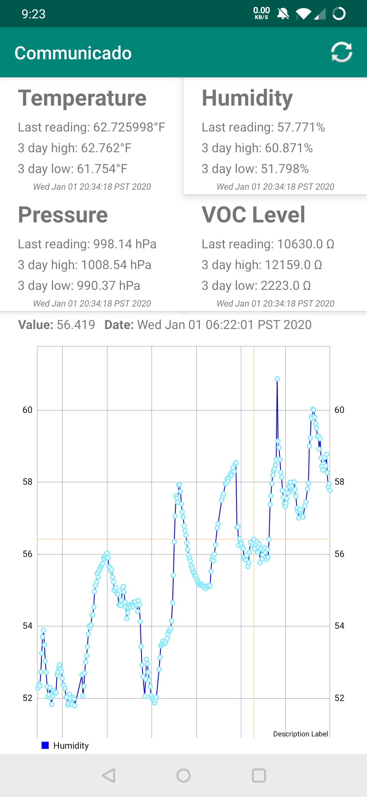

# bme680-project
This is a home project written by me as a way to get the data from my bme680 sensor from my Raspberry Pi to my Android phone. 

# Communicado App

This is pretty simple, since I anticipate I'll be the only one to actually use it. It's a one page/activity app, with 4 panels that display the temperature, pressure, VOC gas resistance and humidity. Below is a graph implemented using the MP Android Chart library. The default graph is for temperature, but it can be toggled to any of the other values by clicking on that panel.The graph can be scrubbed left to right to display the value and the date of that particular data point. 

# Raspberry PI

Two files are used, communicado.py and helper_funcs.py. Assuming that the sensor is wired in the I2C configuration, all you need to do is run python communicado.py to start pulling data from the sensor and sending it to the Android app.

